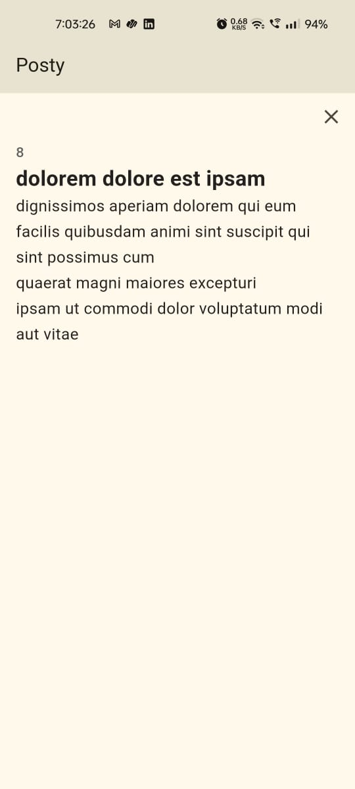
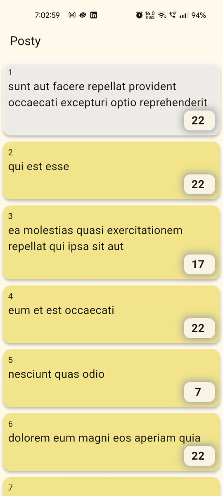

# Posty - Flutter Posts App

A simple Flutter application to display posts fetched from [JSONPlaceholder](https://jsonplaceholder.typicode.com/). Built with **BLoC architecture**, it demonstrates state management, API integration, timers, and visibility detection.
## Screenshots

## Features

- Fetch posts from API and display in a list.
- Tap a post to view detailed content.
- Each post has a countdown timer that:
  - Starts when the post appears on screen.
- Visited posts change background color.
- Smooth state management using BLoC.

## Dependencies

- [flutter_bloc]
- [http]
- [visibility_detector]

## How to Run

1. Clone the repository:
   git clone https://github.com/mauryamj/posty
Navigate to the project folder:
cd posty
Get dependencies:
flutter pub get
Run the app:
flutter run

##Project Structure
-lib/data/ – Models and repository for API calls.

-lib/ui/home/ – Screens, widgets, and BLoC for Home.

-lib/main.dart – Entry point.
